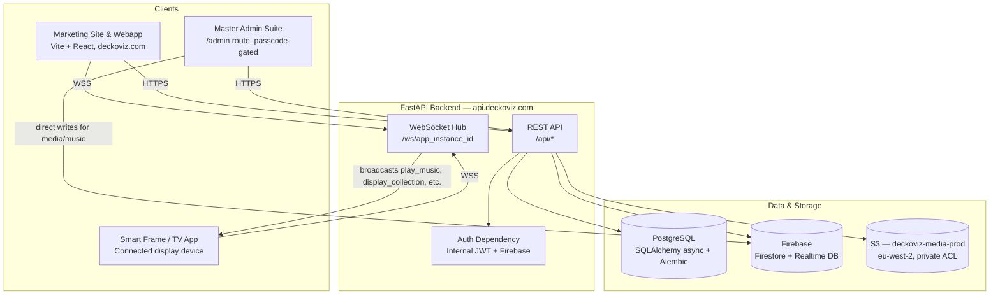
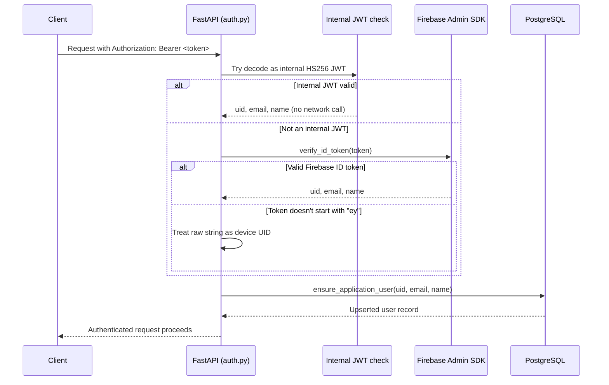
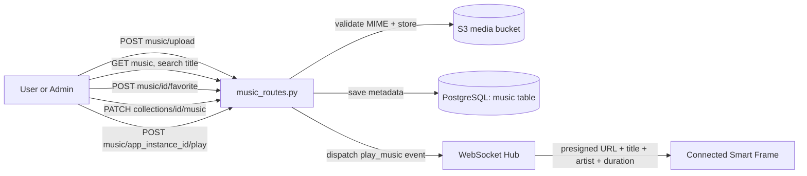
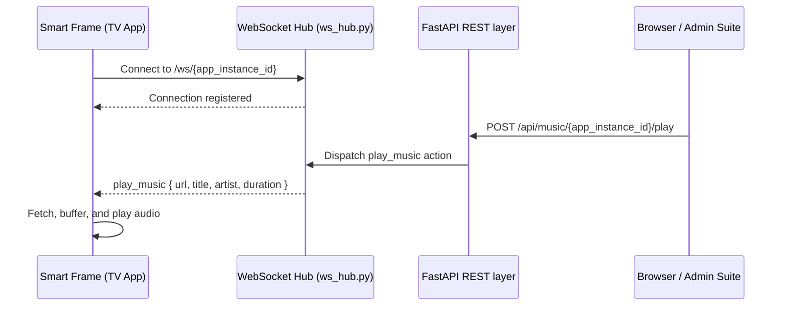
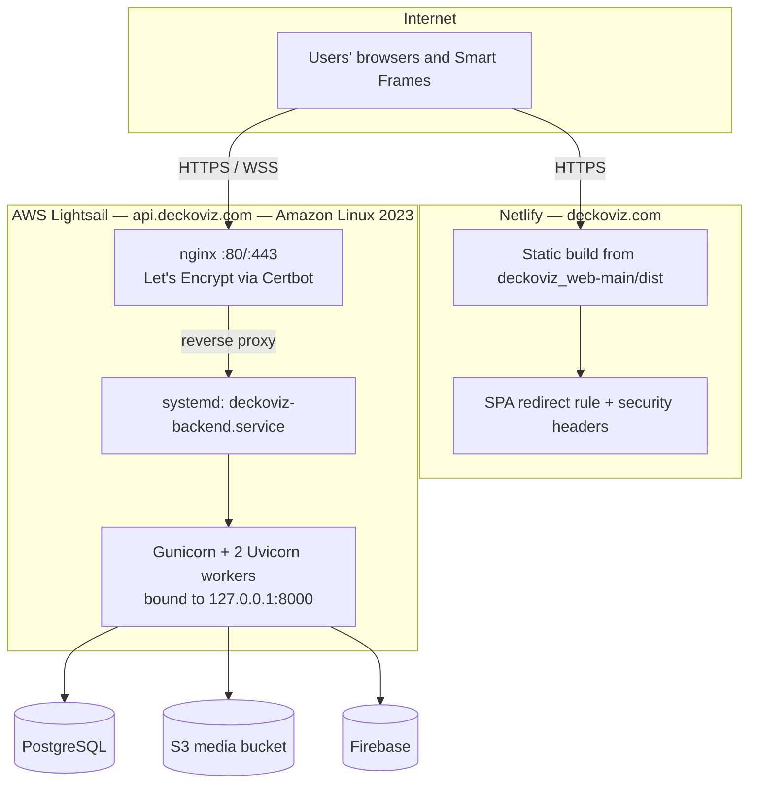

<div align="center">

<h1 style="font-size:2.6em; margin-bottom:0; letter-spacing:-0.02em;">DECKOVIZ</h1>
<p style="font-size:1.15em; color:#6b6b6b; margin-top:4px;">
AI-powered smart art frame and content platform.
</p>

<p>
<code>Founded 2022</code> &nbsp;·&nbsp; <code>UK</code> &nbsp;·&nbsp; <code>deckoviz.com</code>
</p>

</div>

<br/>

<blockquote style="border-left: 4px solid #444; padding: 8px 16px; color:#555;">
This is the engineering reference for the Deckoviz platform: what the product is, the systems underneath it, and the exact steps required to run, extend, and deploy it.
</blockquote>

<br/>

## Table of Contents

<div style="line-height:1.9;">

1. [Product Overview](#product-overview)
2. [What Deckoviz Actually Is](#what-deckoviz-actually-is)
3. [System Architecture, End to End](#system-architecture-end-to-end)
4. [The Technology Underneath](#the-technology-underneath)
5. [The Backend: FastAPI on a Deliberately Old Python](#the-backend-fastapi-on-a-deliberately-old-python)
6. [Authentication: Three Ways In, One Identity](#authentication-three-ways-in-one-identity)
7. [The Data Layer: PostgreSQL and Firebase, Side by Side](#the-data-layer-postgresql-and-firebase-side-by-side)
8. [The Frontend: A Vite and React Application](#the-frontend-a-vite-and-react-application)
9. [The Master Admin Suite](#the-master-admin-suite)
10. [Media, Storage, and the S3 Layer](#media-storage-and-the-s3-layer)
11. [The Music System](#the-music-system)
12. [LiveArt: Sixteen Ways to Make a Wall Move](#liveart-sixteen-ways-to-make-a-wall-move)
13. [Real-Time Devices: WebSockets and Pairing](#real-time-devices-websockets-and-pairing)
14. [Deployment Architecture](#deployment-architecture)
15. [Redeploying: The Exact Steps](#redeploying-the-exact-steps)
16. [Known Constraints and Hard-Won Lessons](#known-constraints-and-hard-won-lessons)
17. [Running It Locally](#running-it-locally)
18. [Environment Variables Reference](#environment-variables-reference)
19. [Contributing](#contributing)

</div>

<br/>

<hr style="border:none; height:1px; background:linear-gradient(to right, transparent, #ccc, transparent);"/>

<h2 id="product-overview" style="border-bottom:2px solid #222; padding-bottom:6px;">1 · Product Overview</h2>

Deckoviz is a smart art frame platform that combines a connected physical display (the Deckoviz Smart Frame, plus TV app and browser clients) with a backend service that personalizes and delivers visual, musical, and ambient content to it. An AI assistant, Vizzy, builds a model of a user's taste and context from onboarding input and ongoing interaction, and the platform uses that model to select, generate, and curate content shown on connected displays in real time.

The platform serves both individual consumers (a single home frame) and enterprise customers (multiple frames across an office, hotel, or experience center), managed through a dedicated administrative interface. The remainder of this document covers the technical implementation: system architecture, backend and frontend structure, data storage, authentication, real-time device communication, and deployment.

<br/>

<h2 id="what-deckoviz-actually-is" style="border-bottom:2px solid #222; padding-bottom:6px;">2 · What Deckoviz Actually Is</h2>

Strip away the hardware and Deckoviz is, at its core, a platform with four jobs:

- **Understand a person's taste and context** — through onboarding signals, saved collections, and ongoing interaction, expressed through an AI companion called Vizzy.
- **Generate and curate visual, musical, and ambient content** — artwork, music, and generative visualizer experiences that suit that person's space and moment.
- **Deliver that content in real time** — to a connected Smart Frame, a TV app, a phone, or a browser, with the display always in sync with what the person just chose.
- **Give teams and enterprise customers a way to run this at scale** — from a single home frame to an entire office, hotel lobby, or experience center.

Those four jobs map fairly directly onto four parts of the codebase: a Python backend that owns data and business logic, a React frontend that is the primary surface people touch, a real-time layer that keeps physical screens synchronized with software decisions, and a media pipeline that moves images, audio, and generated content safely and quickly. The rest of this document walks through each of those in the order a new engineer would actually need them.

<br/>

<h2 id="system-architecture-end-to-end" style="border-bottom:2px solid #222; padding-bottom:6px;">3 · System Architecture, End to End</h2>

At the highest level, every client — the marketing site, the consumer webapp, the Master Admin Suite, and a connected TV frame — talks to a single FastAPI backend, which in turn talks to PostgreSQL for structured data, Firebase for real-time mirrored data and authentication, and S3 for anything that is actually a file.



Two details in this diagram matter more than they look. First, the admin suite writes some content — artwork and music metadata for the global library — directly to Firebase rather than through the FastAPI REST layer, because that library is meant to reach connected frames in real time without a round trip through PostgreSQL. Second, the WebSocket hub is a genuinely separate concern from the REST API: REST is how state gets changed, WebSocket is how a screen finds out about it the moment it happens.

<br/>

<h2 id="the-technology-underneath" style="border-bottom:2px solid #222; padding-bottom:6px;">4 · The Technology Underneath</h2>

<table>
<tr><th align="left">Layer</th><th align="left">Choice</th><th align="left">Why it's this and not something newer</th></tr>
<tr><td>Backend framework</td><td>FastAPI, Python 3.9</td><td>Async-native, typed, self-documenting via <code>/docs</code> and <code>/redoc</code>; pinned to 3.9 to match the production host's system Python.</td></tr>
<tr><td>Backend server</td><td>Gunicorn + Uvicorn workers</td><td>Gunicorn as the resilient process manager, Uvicorn workers for actual ASGI serving.</td></tr>
<tr><td>Database</td><td>PostgreSQL via async SQLAlchemy + asyncpg</td><td>Relational integrity for the data that has to be correct: users, collections, media records.</td></tr>
<tr><td>Migrations</td><td>Alembic</td><td>Versioned, reviewable schema history alongside the ORM models.</td></tr>
<tr><td>Real-time mirror</td><td>Firebase Firestore + Realtime Database</td><td>Push-based reads for connected TV frames and the admin suite, without polling PostgreSQL.</td></tr>
<tr><td>Auth</td><td>Firebase Auth + internally signed JWTs</td><td>Firebase handles identity; the backend issues its own short-lived, backend-scoped session token.</td></tr>
<tr><td>Object storage</td><td>Amazon S3, eu-west-2</td><td>Private-by-default bucket with presigned URLs — no public asset URLs anywhere in the system.</td></tr>
<tr><td>Frontend framework</td><td>React 18 + TypeScript + Vite 5</td><td>Fast local iteration, and React 18 specifically to stay compatible with the 3D rendering stack below.</td></tr>
<tr><td>3D / generative visuals</td><td>Three.js + @react-three/fiber v8 + drei + postprocessing</td><td>Powers the LiveArt modes and the World Builder; v8 is pinned deliberately (see Section 16).</td></tr>
<tr><td>Styling</td><td>Tailwind CSS</td><td>Utility-first styling across a large, feature-sharded component tree.</td></tr>
<tr><td>Backend hosting</td><td>AWS Lightsail, Amazon Linux 2023</td><td>A predictable, fixed-spec VM with nginx and systemd doing the heavy lifting.</td></tr>
<tr><td>Frontend hosting</td><td>Netlify</td><td>Git-based continuous deployment straight from <code>main</code>, with SPA routing and security headers configured in <code>netlify.toml</code>.</td></tr>
</table>

<br/>

<h2 id="the-backend-fastapi-on-a-deliberately-old-python" style="border-bottom:2px solid #222; padding-bottom:6px;">5 · The Backend: FastAPI on a Deliberately Old Python</h2>

The entire backend lives in `fastapi_backend/` and is a single FastAPI application, not a collection of microservices. `main.py` is the front door — it builds the app instance, registers every router, and uses lifespan management to verify the database connection on startup and cleanly close the async connection pool on shutdown. Everything is namespaced under `/api`, and the interactive documentation at `/docs` and `/redoc` is generated straight from the route type hints, which makes it the fastest way to explore the surface area of the API without reading a single line of route code.

The module layout is intentionally flat and readable:

```
fastapi_backend/
├── main.py              # app entrypoint, router registration, lifespan hooks
├── config.py            # pydantic-settings Settings class — every env var lives here
├── auth.py              # get_current_user dependency, JWT creation
├── database.py          # async SQLAlchemy engine, asyncpg driver
├── models.py            # every ORM model — the PostgreSQL schema in Python
├── schemas.py            # Pydantic request/response contracts
├── postgres_store.py    # database access functions
├── firebase_config.py   # Firebase Admin SDK init, verify_token
├── local_music_store.py # dev-only disk storage for audio uploads
├── routes/               # one router module per feature area
├── services/             # WebSocket hub, pairing, device registry, S3 client
├── alembic/              # migration environment and versions
└── data/                 # static seed data, e.g. the prompt library
```

One constraint shapes almost every line written in this directory: **the production Lightsail server runs Python 3.9, not something newer.** That single fact rules out `X | Y` union syntax, `match` statements, and any 3.10-only standard-library feature. Every optional type is written as `typing.Optional[X]`, every list as `typing.List[X]`, every dict as `typing.Dict[K, V]`. It is a small piece of friction that buys a large amount of stability, because Amazon Linux 2023's system Python is exactly what the server has, and there is no appetite to maintain a separate interpreter install on a production box just to write slightly shorter type hints.

The route modules are organized by who is using them rather than by data type, which is worth knowing before you go looking for something:

<table>
<tr><th align="left">Module</th><th align="left">Mounted under</th><th align="left">Responsibility</th></tr>
<tr><td><code>auth_routes.py</code></td><td><code>/api/auth</code></td><td>Exchanges a Firebase token for an internal session via <code>POST /api/auth/signin</code>.</td></tr>
<tr><td><code>webapp_routes.py</code>, <code>home_routes.py</code></td><td><code>/api</code></td><td>Bulk of the consumer experience: profiles, collections, collection items, events, saved notes, and the daily display queue. <code>home_routes.py</code> additionally dual-writes to Firestore for the Home Suite.</td></tr>
<tr><td><code>enterprise_routes.py</code></td><td><code>/api/enterprise</code></td><td>Mirrors the consumer surface for business customers — enterprise profiles, collections, and pairing.</td></tr>
<tr><td><code>vizzy_routes.py</code></td><td><code>/api/vizzy</code></td><td>Runs the Vizzy AI assistant's chat sessions, persisting history in the <code>vizzy_chat_sessions</code> table.</td></tr>
<tr><td><code>upload_routes.py</code>, <code>music_routes.py</code></td><td><code>/api/upload</code>, <code>/api/music</code></td><td>The two doors into S3 (covered in full in Sections 10 and 11).</td></tr>
<tr><td><code>pairing_routes.py</code>, <code>queue_routes.py</code>, <code>curator_routes.py</code></td><td><code>/api/pairing</code>, <code>/api/queue</code>, <code>/api/curator</code></td><td>Device pairing, display scheduling, and curated content.</td></tr>
<tr><td><code>ws_routes.py</code></td><td><code>/ws</code></td><td>Exposes the live WebSocket endpoint at <code>/ws/{app_instance_id}</code> along with connection-status and health checks.</td></tr>
<tr><td><code>promptLibraryRoutes.py</code></td><td><code>/api/prompt-library</code></td><td>Serves static, vertical-specific prompt templates — restaurants and cafes, retail, hotels, schools, and home — for anyone building an experience with Vizzy.</td></tr>
</table>

A typical request follows the same shape end to end regardless of which router handles it: FastAPI validates the incoming payload against a Pydantic model in `schemas.py`, the `get_current_user` dependency from `auth.py` resolves and injects the authenticated user, the route handler calls into a corresponding function in `postgres_store.py` (or a `services/` module for anything real-time, S3-backed, or Firebase-mirrored), and the return value is serialized back out through a response-model schema. Route handlers themselves stay thin — the goal is that `postgres_store.py` and `services/` hold the actual business logic, so it stays testable independent of the HTTP layer.

<br/>

<h2 id="authentication-three-ways-in-one-identity" style="border-bottom:2px solid #222; padding-bottom:6px;">6 · Authentication: Three Ways In, One Identity</h2>

Deckoviz's auth model exists to solve a specific problem: browsers, TV frames, and admin tools all need to authenticate, but they shouldn't all pay the cost of a network round trip to Google every single time. The `get_current_user` dependency in `auth.py` resolves a bearer token in a strict, three-step order, stopping at the first one that succeeds.



That third branch exists specifically for device pairing flows, where a TV frame may present a raw identifier rather than anything resembling a token. The Firebase verification path runs off the asyncio event loop through a small thread pool (capped at four workers) so a slow call to Google's public key endpoint never blocks the rest of the API. After any successful resolution — whichever branch it came from — the user's PostgreSQL record is upserted, and a matching document is lazily created in the Firestore `users` collection the first time that person is seen.

The one path a browser actually uses on sign-in is `POST /api/auth/signin`: the frontend hands over a Firebase ID token, the backend verifies it, upserts the user, and returns an internally signed JWT — good for seven days — that the frontend then attaches to everything else it does. That internal JWT is what keeps most requests fast: no Firebase network call, just an HMAC signature check with `SECRET_KEY` under `HS256`.

<br/>

<h2 id="the-data-layer-postgresql-and-firebase-side-by-side" style="border-bottom:2px solid #222; padding-bottom:6px;">7 · The Data Layer: PostgreSQL and Firebase, Side by Side</h2>

Deckoviz runs two databases on purpose, not by accident. PostgreSQL is the source of truth for anything that needs relational integrity and query flexibility. Firebase is the fast, push-based mirror that lets connected screens and the admin suite react to changes instantly, without polling.

**PostgreSQL**, reached through an async SQLAlchemy 2.0 engine over `asyncpg` and versioned with Alembic, holds the shape of the product:

- `users` and `profiles` — accounts and the extended bio, style, and follower data layered on top of them.
- `collections` and `collection_items` — the core content object in Deckoviz: a named, orderable set of artwork, each with its own display timing and optional background music.
- `uploaded_media` and `media_objects` — user uploads and generated media, with `media_objects` acting as a normalized registry of everything actually sitting in S3 (object key, bucket, checksum, size) so file bytes never touch the database.
- `daily_queue_slots` and `event_items` — the scheduling layer that decides what a frame shows and when.
- `vizzy_chat_sessions` — full conversation history for the Vizzy assistant, including which agent was active.
- `curation_items` and `saved_note_items` — curated recommendations and free-form user notes.
- `user_documents` — a JSONB catch-all for variable-shaped payloads (enterprise units, templates, settings) that would otherwise force a schema migration every time a new feature needed one more field.

**Firebase** runs alongside this as a real-time complement rather than a replacement. Firestore mirrors user accounts, and holds `media` and `music` collections that back the Master Admin Suite's global content library. The Realtime Database exposes `/media` and `/music` nodes so that connected TV frames and the admin suite can subscribe to changes and update instantly, and it also backs collections, queue slots, events, curation items, enterprise data, and pairing sessions as a live fallback layer alongside PostgreSQL.

<br/>

<h2 id="the-frontend-a-vite-and-react-application" style="border-bottom:2px solid #222; padding-bottom:6px;">8 · The Frontend: A Vite and React Application</h2>

The active frontend lives in `deckoviz_web-main` and is a React 18 single-page application built with Vite 5 and TypeScript. (An earlier Next.js frontend exists in the repository's history; it has been fully retired and none of the current build, routing, or deployment behavior depends on it.)

`App.tsx` holds the entire routing tree via `react-router-dom` v6. The directory structure follows a fairly conventional but disciplined shape: `pages/` for full-page components, `components/` organized by feature area, `lib/` for typed API client modules and Firebase helpers, `context/` for app-wide React context (most importantly `AuthContext.tsx`, which wraps Firebase's `onAuthStateChanged` listener), `hooks/` for shared logic like WebSocket lifecycle management, and `content/`/`data/` for the markdown-driven blog.

A handful of standalone pages carry most of the product's identity: `MasterSuiteOfFeatures.tsx` (the admin suite, covered next), `CreateWorld.tsx` (a 3D world-building experience), `DisplayOnTvPage.tsx` (the TV frame's own display mode), `PairDevicePage.tsx` (QR-code pairing), and `VizzyFunZone.tsx` (an interactive AI art generation playground). State management stays deliberately simple — `useState`, `useEffect`, and `useContext`, no external state library — because the API client modules in `lib/` (`webappApi.ts`, `enterpriseApi.ts`, `homeApi.ts`, `curatorApi.ts`, `pairingApi.ts`, `vgcApi.ts`) already give each feature area a clean, typed boundary against the backend, all pointed at the production API URL hardcoded in `src/lib/constants.ts`.

<br/>

<h2 id="the-master-admin-suite" style="border-bottom:2px solid #222; padding-bottom:6px;">9 · The Master Admin Suite</h2>

Behind a client-side passcode at `/admin` (implemented in `MasterSuiteOfFeatures.tsx`) sits the operational cockpit for the whole platform. It is not a separate application — it is a set of components under `src/components/admin/` — but it behaves like one, and it is the one part of the frontend that is allowed to bypass the FastAPI REST layer and write to Firebase directly, because its content needs to reach every connected frame the instant it's published rather than after a round trip through PostgreSQL. It is organized into five modules:

<table>
<tr><th align="left">Module</th><th align="left">Function</th></tr>
<tr><td>Dashboard</td><td>Registered users, active frames, artwork counts, storage usage, and revenue at a glance.</td></tr>
<tr><td>User Directory</td><td>Search and manage accounts by subscription tier.</td></tr>
<tr><td>Global Media Library</td><td>Writes artwork and music records directly into Firestore and the Realtime Database rather than through the REST API. Includes a "Send to Frame" action that fires a live <code>play_music</code> command over WebSocket to a specific connected device.</td></tr>
<tr><td>Smart Frame Devices</td><td>Remote commands issued to paired frames: reload, sleep, play, switch collection.</td></tr>
<tr><td>Subscriptions and Settings</td><td>Tier pricing, AI credit quotas, and global announcements.</td></tr>
</table>

<br/>

<h2 id="media-storage-and-the-s3-layer" style="border-bottom:2px solid #222; padding-bottom:6px;">10 · Media, Storage, and the S3 Layer</h2>

Every piece of media that a user uploads or the platform generates ends up in Amazon S3, in the `deckoviz-media-prod` bucket, in `eu-west-2`. Nothing in that bucket is publicly reachable by a direct URL — every object carries a private ACL, and the only way to actually retrieve a file is through a presigned URL generated on demand by `services/s3_storage.py`, using boto3, with a one-hour expiry. Credentials never live in application config; they come from the IAM instance role attached to the Lightsail box itself, resolved automatically through boto3's standard credential chain.

The upload path is intentionally narrow: `POST /api/upload` accepts a multipart image, stores it under the `media/` prefix, records it in the `media_objects` table alongside its checksum and size, and hands back a presigned URL. A 25 MB ceiling on upload size keeps this predictable. Music uploads follow the identical pattern under `media/{firebase_uid}/{filename}`, so every user's audio lives in its own namespaced path inside the same bucket.

<br/>

<h2 id="the-music-system" style="border-bottom:2px solid #222; padding-bottom:6px;">11 · The Music System</h2>

Music in Deckoviz is not a bolted-on media type — it's a first-class part of the ambience a collection creates, and the API surface for it (documented separately for third-party integrators in `MUSIC_API_DOCUMENTATION.md`) reflects that. Every call requires a Firebase ID token in the `Authorization` header, hitting `https://api.deckoviz.com` as the base URL.



Uploading validates the MIME type against a fixed allow-list (`audio/mpeg`, `audio/mp4`, `audio/ogg`, `audio/wav`, `audio/webm`) before anything touches S3. Once a track exists, it can be searched by title, favorited per-user, and assigned directly to a collection so it plays whenever that collection is displayed. The most interesting endpoint in the set is `POST /api/music/{app_instance_id}/play`: it resolves a presigned URL for the track and pushes a `play_music` action straight down the WebSocket connection to a specific screen, carrying the file URL, title, artist, and duration in one payload — the mechanism the admin suite's "Send to Frame" button relies on. In local development, setting `DEV_LOCAL_MUSIC_STORAGE=true` swaps S3 for disk storage via `local_music_store.py`, so audio testing doesn't require real cloud credentials.

<br/>

<h2 id="liveart-sixteen-ways-to-make-a-wall-move" style="border-bottom:2px solid #222; padding-bottom:6px;">12 · LiveArt: Sixteen Ways to Make a Wall Move</h2>

LiveArt is a set of sixteen real-time, music-reactive 3D visualizer modes, each a self-contained component under `src/pages/LiveArt/modes/`, sharing a common wrapper — `LiveArtWrapper.jsx` — that handles audio input and shared controls so each mode only has to think about what it renders, not how it receives sound.

<table>
<tr><th align="left">Category</th><th align="left">Modes</th><th align="left">Underlying technique</th></tr>
<tr><td>Aurora / particle fields</td><td><code>AuroraField</code>, <code>AuroraLedger</code></td><td>Particle systems driven by audio amplitude.</td></tr>
<tr><td>Organic growth</td><td><code>CoralBloom</code>, <code>CrystallineGrowth</code>, <code>DigitalGarden</code></td><td>Procedural growth simulations.</td></tr>
<tr><td>Fluid / ink dynamics</td><td><code>CosmicFluid</code>, <code>InkTide</code>, <code>LivingInk</code>, <code>Ripple</code></td><td>Simplex-noise-driven fluid fields (<code>simplex-noise</code>).</td></tr>
<tr><td>Flocking behavior</td><td><code>Murmuration</code></td><td>Boid-style flocking algorithm.</td></tr>
<tr><td>Gravitational particles</td><td><code>Gravity</code></td><td>Particle system with bloom post-processing.</td></tr>
<tr><td>Architectural / light</td><td><code>LightArchitecture</code>, <code>KineticSculpture</code></td><td>Orbit-controlled camera with structured geometry.</td></tr>
<tr><td>Underwater</td><td><code>OceanicBioluminescence</code></td><td>Emissive particle fields.</td></tr>
<tr><td>Waveform</td><td><code>Resonance</code></td><td>Direct waveform-to-geometry mapping.</td></tr>
<tr><td>Cellular automata</td><td><code>DigitalLife</code></td><td>Life-simulation grid rendered in 3D.</td></tr>
<tr><td>Abstract noise fields</td><td><code>Reverie</code></td><td>Layered simplex-noise fields.</td></tr>
</table>

All sixteen modes run on Three.js and `@react-three/fiber`, with `@react-three/drei` supplying camera and geometry helpers and `@react-three/postprocessing` supplying bloom effects where a mode needs them. Because every mode shares `LiveArtWrapper.jsx` for audio input, adding a new mode is primarily a matter of writing a new Three.js scene component and registering it in the mode list — the audio-reactivity plumbing does not need to be reimplemented per mode.

<br/>

<h2 id="real-time-devices-websockets-and-pairing" style="border-bottom:2px solid #222; padding-bottom:6px;">13 · Real-Time Devices: WebSockets and Pairing</h2>

A Smart Frame is only as good as its connection to the backend, so Deckoviz treats that connection as core infrastructure rather than an afterthought. `services/ws_hub.py` keeps an in-memory map of `app_instance_id` to active WebSocket connection, and every connected screen reaches it through `/ws/{app_instance_id}`. Once connected, a frame can be the target of typed action payloads broadcast from anywhere in the backend — `play_music` for audio, and the same mechanism generalizes to display and collection commands.



Getting a frame into that map in the first place is the job of the pairing system. `services/pairing_store.py` issues short-lived six-digit codes that link a mobile or web session to a physical device, `GET /api/pairing/session` creates one, `POST /api/pairing/confirm` completes it, and `DELETE /api/pairing/session` tears it down. `services/device_registry.py` then tracks which devices are actually online, and `services/queue_store.py` handles the logic behind the daily display schedule that decides what a paired frame shows without a person needing to be actively driving it.

<br/>

<h2 id="deployment-architecture" style="border-bottom:2px solid #222; padding-bottom:6px;">14 · Deployment Architecture</h2>

Production is split cleanly across two providers, each doing the thing it's best at: AWS Lightsail runs the stateful backend, and Netlify runs the stateless, git-driven frontend.



On the backend side, the domain `api.deckoviz.com` points via a DNS A record straight at the Lightsail instance's public IP. Nginx terminates SSL (Let's Encrypt, renewed via Certbot) and reverse-proxies everything to `127.0.0.1:8000`, where Gunicorn runs two Uvicorn workers with a 120-second timeout. The whole thing is wired into systemd as `deckoviz-backend.service`, with environment variables — `DATABASE_URL`, `S3_MEDIA_BUCKET`, `SECRET_KEY`, `FIREBASE_CREDENTIALS_FILE` — supplied either directly in the unit file or via an `EnvironmentFile`. The Firebase service-account key sits at `/etc/deckoviz/firebase-service-account.json`, and the whole application runs out of a Python 3.9 virtual environment at `fastapi_backend/.venv39`.

On the frontend side, Netlify watches the `main` branch of the GitHub repository and rebuilds automatically on every push. `netlify.toml` at the repository root sets the base directory to `deckoviz_web-main`, the build command to `npm run build`, and the publish directory to `dist` (so the real output path is `deckoviz_web-main/dist`). Node is pinned to version 20, `NPM_CONFIG_LEGACY_PEER_DEPS` is set to `true` to avoid `ERESOLVE` failures during install, a catch-all redirect sends every path to `index.html` for client-side routing, and a fixed set of security headers (`X-Frame-Options: DENY`, `X-Content-Type-Options: nosniff`, a strict `Referrer-Policy`, and cache controls) are applied globally. Any `VITE_`-prefixed variable the frontend needs at build time has to be set in Netlify's own environment variable dashboard, since Vite bakes those values into the bundle at build time, not at runtime.

<br/>

<h2 id="redeploying-the-exact-steps" style="border-bottom:2px solid #222; padding-bottom:6px;">15 · Redeploying: The Exact Steps</h2>

<h3>Backend (AWS Lightsail)</h3>

<ol style="line-height:1.9;">
<li>SSH into the Lightsail instance and navigate into the repository directory.</li>
<li>Pull the latest code: <code>git pull origin main</code></li>
<li>Activate the virtual environment: <code>source fastapi_backend/.venv39/bin/activate</code></li>
<li>Install any new dependencies: <code>pip install -r fastapi_backend/requirements.txt</code></li>
<li>If the schema changed, run the migration: <code>alembic -c fastapi_backend/alembic.ini upgrade head</code></li>
<li>Restart the service: <code>sudo systemctl restart deckoviz-backend.service</code></li>
<li>Confirm it came back up: <code>sudo systemctl status deckoviz-backend.service</code></li>
<li>If anything looks wrong, check the logs: <code>sudo journalctl -u deckoviz-backend.service -n 100 --no-pager</code></li>
<li>Finally, hit <code>/api/health</code> — it reports database connectivity and the active S3 bucket name, and is the fastest way to confirm a clean deploy.</li>
</ol>

<h3>Frontend (Netlify)</h3>

Frontend deploys require no manual steps at all under normal circumstances. Netlify is watching `main`; a merge to that branch triggers a build using `npm run build` from `deckoviz_web-main`, and a successful build publishes automatically to `deckoviz.com`. The only time this needs manual attention is when a new `VITE_`-prefixed environment variable is introduced — that has to be added in the Netlify dashboard before the next build, or it will silently be `undefined` in production.

<br/>

<h2 id="known-constraints-and-hard-won-lessons" style="border-bottom:2px solid #222; padding-bottom:6px;">16 · Known Constraints and Hard-Won Lessons</h2>

Four constraints show up often enough that every contributor should internalize them before their first pull request:

- **Python 3.9, no exceptions.** The production server's system interpreter is 3.9. Any `X | Y` union type, `match` statement, or other 3.10+ syntax will pass locally on a newer interpreter and then throw a `SyntaxError` the moment it hits production. Use `typing.Optional`, `typing.Union`, `typing.List`, and `typing.Dict` everywhere.
- **React 18, not 19 — and that's deliberate.** The LiveArt and world-building features depend on `@react-three/fiber` v8 (`^8.18.0`), which requires React 18. Version 9 of that library requires React 19, which would be a breaking upgrade across the entire 3D rendering stack. `three` is pinned at `^0.183.2`, including in the `overrides` section of `package.json`, specifically to prevent transitive version drift.
- **`NPM_CONFIG_LEGACY_PEER_DEPS=true` is load-bearing on Netlify.** Some dependencies declare peer requirements that don't line up cleanly with what's actually installed. Without this flag, Netlify's `npm install` step fails outright with `ERESOLVE` errors.
- **The old Next.js frontend is gone, not paused.** It exists in git history, but it is not built, not deployed, and not a fallback. If you're looking at code and it doesn't live in `deckoviz_web-main`, it isn't part of the running product.

<br/>

<h2 id="running-it-locally" style="border-bottom:2px solid #222; padding-bottom:6px;">17 · Running It Locally</h2>

**Backend**

<ol style="line-height:1.9;">
<li>Copy <code>.env.example</code> to <code>.env</code> inside <code>fastapi_backend</code> and fill in <code>DATABASE_URL</code>, <code>S3_MEDIA_BUCKET</code>, and your Firebase credentials.</li>
<li>Set <code>DEV_LOCAL_MUSIC_STORAGE=true</code> if you'd rather store test audio on disk than in S3.</li>
<li>Create a Python 3.9 virtual environment: <code>python3.9 -m venv .venv39</code>, then activate it.</li>
<li>Install dependencies: <code>pip install -r requirements.txt</code></li>
<li>Start the server from inside <code>fastapi_backend</code>: <code>uvicorn main:app --reload</code></li>
<li>The API is now live at <code>http://localhost:8000</code>, with interactive docs at <code>http://localhost:8000/docs</code>.</li>
</ol>

**Frontend**

<ol style="line-height:1.9;">
<li>From <code>deckoviz_web-main</code>, run <code>npm install</code>.</li>
<li>If you need Supabase-backed features locally, create <code>.env.development.local</code> with <code>VITE_SUPABASE_URL</code> and <code>VITE_SUPABASE_ANON_KEY</code>.</li>
<li>Run <code>npm run dev</code>. The app is now live at <code>http://localhost:5173</code>.</li>
<li>To reach the Master Admin Suite locally, visit <code>/admin</code> and enter the local passcode configured for your environment.</li>
</ol>

<br/>

<h2 id="environment-variables-reference" style="border-bottom:2px solid #222; padding-bottom:6px;">18 · Environment Variables Reference</h2>

<details>
<summary><strong>Backend (fastapi_backend/config.py)</strong> — click to expand</summary>
<br/>

<table>
<tr><th align="left">Variable</th><th align="left">Default</th><th align="left">Notes</th></tr>
<tr><td><code>DATABASE_URL</code></td><td>required</td><td>asyncpg-compatible PostgreSQL connection string.</td></tr>
<tr><td><code>S3_MEDIA_BUCKET</code></td><td>required</td><td>Production value is <code>deckoviz-media-prod</code>.</td></tr>
<tr><td><code>AWS_REGION</code></td><td><code>eu-west-2</code></td><td>London region for all S3 traffic.</td></tr>
<tr><td><code>S3_PRESIGNED_URL_EXPIRES_SECONDS</code></td><td><code>3600</code></td><td>One-hour expiry on every generated media URL.</td></tr>
<tr><td><code>S3_MAX_UPLOAD_BYTES</code></td><td><code>26214400</code></td><td>25 MB upload ceiling.</td></tr>
<tr><td><code>FIREBASE_CREDENTIALS_FILE</code></td><td><code>/etc/deckoviz/firebase-service-account.json</code></td><td>Path to the Admin SDK service account on the production server.</td></tr>
<tr><td><code>FIREBASE_CREDENTIALS_JSON</code></td><td>—</td><td>Alternative: raw JSON content as an env var instead of a file path.</td></tr>
<tr><td><code>FIREBASE_STORAGE_BUCKET</code></td><td><code>deckoviz-app.appspot.com</code></td><td>&nbsp;</td></tr>
<tr><td><code>SECRET_KEY</code></td><td>required</td><td>HMAC signing key for internal JWTs.</td></tr>
<tr><td><code>ACCESS_TOKEN_EXPIRE_MINUTES</code></td><td><code>10080</code></td><td>Seven days.</td></tr>
<tr><td><code>DEV_LOCAL_MUSIC_STORAGE</code></td><td><code>false</code></td><td>Set <code>true</code> locally to store audio on disk instead of S3.</td></tr>
</table>
</details>

<br/>

<details>
<summary><strong>Frontend (deckoviz_web-main)</strong> — click to expand</summary>
<br/>

<table>
<tr><th align="left">Variable</th><th align="left">Purpose</th></tr>
<tr><td><code>VITE_SUPABASE_URL</code></td><td>Supabase project URL, consumed by <code>src/lib/supabase.ts</code>.</td></tr>
<tr><td><code>VITE_SUPABASE_ANON_KEY</code></td><td>Supabase anonymous/public API key.</td></tr>
</table>

<p>Any additional <code>VITE_</code>-prefixed variable must be set in Netlify's dashboard before the next production build, since Vite bakes these into the bundle at build time rather than reading them at runtime.</p>
</details>

<br/>

<h2 id="contributing" style="border-bottom:2px solid #222; padding-bottom:6px;">19 · Contributing</h2>

Before opening a pull request against the backend, run whatever you've written on the pinned 3.9 interpreter — not whatever Python happens to be on your machine — and grep your diff for `|` in type hints out of habit. Before touching frontend dependencies, check whether the change touches `three`, `@react-three/fiber`, `@react-three/drei`, or `@react-three/postprocessing`; if it does, assume the React 18 pin is the reason and confirm before upgrading anything in that family. Schema changes belong in an Alembic migration, not a manual `ALTER TABLE` on production. And if a feature needs to reach a connected Smart Frame in real time, look at how the music system does it before building a new mechanism — the WebSocket hub and the `play_*` / `display_*` action pattern already solve that problem once.

Overall, the codebase is structured as a relatively small, deliberately-scoped backend, a large frontend focused on generative visual work, and a deployment setup that is intentionally simple, so operational risk stays low and effort stays focused on product features.

<div align="center" style="margin-top:32px; color:#888; font-size:0.9em;">
Deckoviz Space Labs — Bristol — deckoviz.com
</div>
